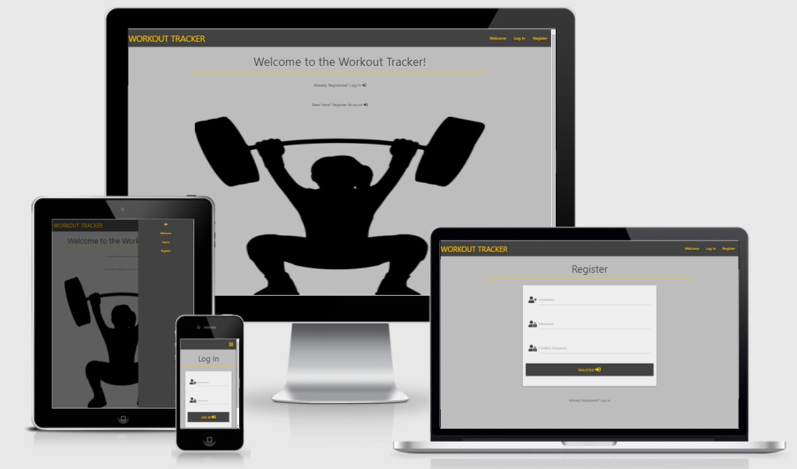

# Workout Tracker
## MS3 Code Institute Project - Data Centric Development

Workout Tracker is a simple to use responsive website for tracking weight training workouts. Users will be directed to either log in or register from the welcome page. From there they will be able to plan workouts by adding exercises with sets and reps to a certain day. From there they can edit, delete or mark as done and view completed workouts as needed.

There is a search function in which the user can search for specific exercises performed to view progression. The website layout will be minimalist and clear, in order to make viewing and updating workout information simple during or after performing a workout, when a user may be fatigued.

[Live Website](https://workout-tracker-ms-project.herokuapp.com/)

## UX

### User Stories

- As a new user, I wish to be directed to the appropriate place to register to the Workout Tracker.

- As a new user, I would like to create a personal profile to log my workouts.

- As a returning user, I want to be able to log in to my own personal user profile.

- As a returning user, I want to be able to plan workouts for the future.

- As a returning user, I want to have the ability to edit planned workouts in case I feel my circumstances have changed.

- As a returning user, I wish to view my previous workouts so that I can compare my exercise progression results.

- As the owner, I want to present an intuitive minimalist style application that allows a user to easily navigate the site.

- As the owner, the application must be responsive, to allow users to track their workouts as they train, or to have the choice of adding, editing or deleting their workout data from any other device.

### Strategy

The Workout Tracker is designed to be usable instead of logging workouts in a paper journal. By making a responsive application, this can be done easily while training or at the user's leisure on a desktop or any device. 

### Scope

It is important to display an intuitive minimalist design as users that log their workouts while training do not want to spend excess time navigating the application and may be fatigued also, which could impair concentration.

### Structure

In each section I want to keep a common navbar which will stick to the page top. Users can use this to navigate the site easily without the use of browser forward and back buttons.

### Skeleton

    Wireframes to be added here

### Surface

#### Colours

- For the navbar and page headings, I used the Materialize color class grey darken-3 (#424242).
  
  

- For each page body I used the Materialize color class grey lighten-1 (#bdbdbd).

  

- For the cards which contained the site content I used the Materialize color class grey lighten-3 (#eeeeee).

  

- For contrast on buttons and on navbar content I used the Materialize color class amber (#ffc107).

  

I found the use of these colours to provide a nice soft contrast that wasn't harsh to look.

### Fonts

I used the Roboto Condensed font from Google Fonts for this website for its clean look and readability.

### Icons

#### All icons used in this project were sourced from Font Awesome

- I used the hamburger icon for my menu because it is widely recognised and used for mobile menus.

- I used the external link icon to indicate the presence of a clickable link on the welcome page to help direct users to either the log in or registration pages.

- I used the double arrow up icon on the completed workout cards to indicate that additional workout notes could be viewed upon clickiing the button.

- I used the plus icon on adding workout data to emphasise the add workout button.

- I used the search icon on the search button to emphasise its use.

## Features
### Features which all users can view:
- Navbar - allows the user to navigate the site using the listed buttons. The company name/logo also acts as a home button.

- Welcome - a simple welcome page which directs a user to log in if returning, or register if new.

### Features which logged in users can view:

- New Workout - The user can record details of benchmarks they wish to execute in their workouts and add it to the workout planner.

- Workout Planner - this feature is only accessible if a user is logged in. It allows a user to plan future workouts, and is sorted by date starting from closest. These workouts can be edited, deleted or marked as complete, which will move it to workout history.

- Delete planned workout - a confirm deletion modal will pop up asking the user if they are sure they wish to delete their planned workout.

- Edit planned workout - the user can edit any planned workout data they have added and return it to the planed workout section.

- Done button - the user can mark a planed workout as done, and will have a final option to edit any workout data, as well as add any additional workout notes they may find useful to remark upon.

- Workout History - the user is presented with a list of their completed workouts, which can  be deleted by the user if they wish. They can also view their workout notes if they have added them here.

### Features which only the Admin can use:

- Exercises - this feature can be used to add new exercises to the database, which can then be selected in the add new workout form. Exercises can also be edited or deleted here. Selecting delete will pop up a confirm delete modal.

### Features to be implemented:

- Features for runners, such as timers and stopwatches.

- A progression graph showing weight progression for exercises.

- Body weight tracker.

- Ability to export workout data.

## Technologies Used
- [Balsamiq Wireframes](https://balsamiq.com/wireframes/?gclid=Cj0KCQiAhs79BRD0ARIsAC6XpaVYvwCWIORZNFLa4ZbfPQf8gAchZhdlP10mZeYDFooTFk1sW1Pua4caAgsmEALw_wcB)
  - The project uses Balsamiq Wireframes for desktop to generate wireframes for the website.

- [Gitpod](https://www.gitpod.io/)
  - I used Gitpod to write my code for this project.

- [Git](https://git-scm.com/)
  - The project uses Git to update records to any changes to files.

- [GitHub](https://github.com/)
  - The project uses Github as a hosting service for version control.

- [Heroku](https://www.heroku.com/)
  - The project uses Heroku to host the website.

- [MongDB](https://www.mongodb.com/)
    - The project uses MongoDB database to store the user information and workout data.

- [Flask](https://flask.palletsprojects.com/)
    - The project uses the Flask Python framework to help develop the application

- [Pip3](https://pip.pypa.io/en/stable/)
    - The project uses pip3 to install Python modules throught the command line.

- [RandomKeygen](https://randomkeygen.com/)
    - The projet uses RandomKeygen to generate strong passwords for the secret key.

- [Materialize](https://materializecss.com/)
  - The project uses the Materialize framework to help build front end of the site.

- [Google Fonts](https://fonts.google.com/)
  - The project uses Google Fonts to style the fonts on the website.

- [Font Awesome](https://fontawesome.com/)
  - The project uses Font Awesome icons throughout the website.

- [Chrome DevTools](https://developers.google.com/web/tools/chrome-devtools)
  - The project uses Chrome DevTools to analyse performance, accessibility, and best practices.

- [CSS Lint](http://csslint.net/)
  - The project uses CSS Lint as an extra testing step after initially manual checks.

- [W3C CSS Validator](https://jigsaw.w3.org/css-validator/#validate_by_input)
  - The project uses this to test CSS by direct input.

- [W3C Markup Validation Service](https://validator.w3.org/#validate_by_input)
  - The project uses this to pinpoint errors in HTML markup.

- [JSHint](https://jshint.com/)
    - The project uses JSHint to detect errors and potential problems in the JavaScript code.

## Testing

Testing documentation can be found at [TESTING.md](TESTING.md)

## Deployment

    Add deployment info here

## Credits
### Media

    Add any external media here

### Acknowledgements

- I used the [Code Institute](https://github.com/Code-Institute-Solutions/readme-template) README template as a base for my own.

- I used the [Code Institute](https://learn.codeinstitute.net/courses/course-v1:CodeInstitute+DCP101+2017_T3/courseware/9e2f12f5584e48acb3c29e9b0d7cc4fe/054c3813e82e4195b5a4d8cd8a99ebaa/) task manager mini project as a template to create my own, similarities in the code can be found throughout the entire application.

- I would like to thank the Slack community as a general source of information and for people willing to lend a hand.

- I would like to thank my partner and children for both supporting and tolerating me during this process.