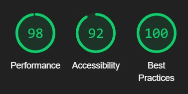
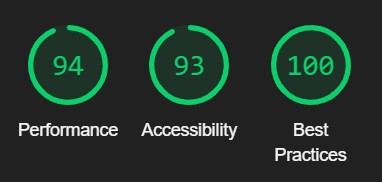

# Testing Documentation: Workout Tracker

The main README documentation can be found at [README.md](README.md)

[Live Website](https://workout-tracker-ms-project.herokuapp.com/)

## Supported Screens and Browsers

Unless otherwise stated, all desktop test cases have been carried out across Google Chrome, Firefox, and Microsoft Edge.
All mobile and tablet platform based testing has been performed using Chrome Devtools virtual devices.
The devices I have chosen and their dimensions are:

 1. Galaxy Fold - 280 x 653
 2. Moto G4 - 360 x 640
 3. iPad - 768 x 1024

## Test Cases

### As a new user, I wish to be directed to the appropriate place to register to the Workout Tracker.

- On arrival to the welcome page, the user is met by two messages, one which asks the user to log in if they are returning, and another which invites them to register if they are a new user. There are also navbar links directing the user to the login and registeration pages. If a user navigates to the wrong form by accident, they have another message inviting them to either log in or register, as well as having the navbar links available to use.

    

### As a new user, I would like to create a personal profile to log my workouts.

- When a new user registers, they can add new workouts to their workout planner page which will only have their planned workouts available to see.

    

### As a returning user, I want to be able to log in to my own personal user profile.

- When a returning user logs in, they can add new workouts to their workout planner page which will only have their planned workouts available to see. They can also view any completed workouts.

    

### As a returning user, I want to be able to plan workouts for the future.

- When a returning user logs in, they can add new workouts to their workout planner page which will only have their planned workouts available to see. These can be edited or deleted according to the users needs.

    

### As a returning user, I want to have the ability to edit planned workouts in case I feel my circumstances have changed.

- A returning user can edit planned workouts according to their needs by clicking the edit button under their chosen workout. This will bring them to an edit workout form.

    

### As a returning user, I wish to view my previous workouts so that I can compare my exercise progression results.

- A returning user can view their previous completed workouts in the workout history section, and can search by exercise name to return all workouts with that exercise for their perusal.

    

### As the owner, I want to present an intuitive minimalist style application that allows a user to easily navigate the site.

- This site uses a simple fixed navbar with clear links to indicate their purpose to the user and make it clear the goal of the website. It uses simple colouring and minimal imagery to reduce visual stimuli to a user that may be tracking their workouts while exercising.

    

### As the owner, the application must be responsive, to allow users to track their workouts as they train, or to have the choice of adding, editing or deleting their workout data from any other device.

- The application is usable on any sized device and navigating the site, a user can move between pages without the use of the browser forward and back buttons. All content is clearly visible and scales correctly to screen size without obscuring any content or overspill.

    

## Code Validation

### [W3C CSS Validator](https://jigsaw.w3.org/css-validator/#validate_by_input)

Validated my CSS by direct input in to the CSS validator and no errors were found.

### [W3C Markup Validation Service](https://validator.w3.org/#validate_by_input)

Ran each page through the validator and found no major issues.

### JSHint

Ran script.js through JSHint, and found no major errors.

### Chrome Devtools

- Welcome:
    1. Desktop
        >  
    2. Mobile
        > 

- Log In:
    1. Desktop
        > 
    2. Mobile
        > 

- Register:
    1. Desktop
        > 
    2. Mobile
        > 

- Workout Planner:
    1. Desktop
        > 
    2. Mobile
        > 

- Workout History:
    1. Desktop
        > 
    2. Mobile
        > 

- Add New Workout:
    1. Desktop
        > 
    2. Mobile
        > 

- Exercises:
    1. Desktop
        > 
    2. Mobile
        > 

- Edit Workout:
    1. Desktop
        > 
    2. Mobile
        > 

- Complete Workout:
    1. Desktop
        > 
    2. Mobile
        > 

- Add Exercise:
    1. Desktop
        > 
    2. Mobile
        > 

- Edit Exercise:
    1. Desktop
        > 
    2. Mobile
        > 

## Manual Testing

### base.hmtl
action taken | expected result | pass/fail
------------ | --------------- | ---------    
**Logo** |
Click Logo | display index.html if logged out, displays workout history.html if logged in | pass
**Navbar** |
Links displayed when not logged in | Welcome/Log in/ Register links should display | pass
Click Log In within navbar | Display login.html | pass
Click Register within navbar | Display register.html | pass
Click Welcome within navbar | Display index.html | pass
When logged in as Admin with a large screen | Workout Planner/ Workout History / New Workout / Exercises/ Log Out links should display | pass
When logged in as user with a large screen | Workout Planner/ Workout History / New Workout / Log Out links should display | pass
Click Workout Planner within navbar | Display workout_planner.html | pass
Click Workout History within navbar | Display workout_history.html | pass
Click New Workout within navbar | Display add_workout.html | pass
Click Exercises within navbar | Display exercises.html | pass
Click Logout within topnav | Display login.html and a flashed message | pass
**sidenav** |
Click burger icon | Sidenav is displayed and hidden. | pass
When not logged in with a medium or small screen | Welcome/ Log in/ Register links should display | pass
Click Welcome within sidenav | Display index.html | pass
Click Log In within sidenav | Display login.html | pass
Click Register within sidenav | Display register.html | pass
When logged in as Admin | Workout Planner/ Workout History / New Workout / Exercises/ Log Out links should display | pass
When logged in as user with a large screen | Workout Planner/ Workout History / New Workout / Log Out links should display | pass
Click Workout Planner within navbar | Display workout_planner.html | pass
Click Workout History within navbar | Display workout_history.html | pass
Click New Workout within navbar | Display add_workout.html | pass
Click Exercises within navbar | Display exercises.html | pass
Click Logout within topnav | Display login.html and a flashed message | pass

### index.html
action taken | expected result | pass/fail
------------ | --------------- | ---------   
Click Log In prompt | display login.html | pass
Click Register prompt | display register.html | pass

> 

### login.html
action taken | expected result | pass/fail
------------ | --------------- | ---------    
Fill in log in form with correct user details | display workout_history.html, display flash message | pass
Fill in log in form with invalid user details | display login.html, display flash message | pass
Click Register prompt | display register.html | pass

> 

### register.html
action taken | expected result | pass/fail
------------ | --------------- | ---------    
Fill in register form with valid details | display workout_history.html, display flash message | pass
Fill in registration form with invalid user details | display register.html, display flash message | pass
Click Log In prompt | display login.html | pass

> 

### workout_history.html
action taken | expected result | pass/fail
------------ | --------------- | ---------    
Arrive in workout_history.html after login/registration | display workout_history.html, display flash message | pass
Search for exercise using valid exercise names | display appropriate workouts | pass
Search for completed exercise using invalid exercise names | display flash message 'no results found' | pass
Click reset button on search form | displays all completed workout cards | pass
Click on up arrow button on workout card | display workout notes | pass
Click on delete button on workout card | display confirm deletion modal | pass
Click on cancel button on confirm deletion modal |clears modal, displays workout_history.html | pass
Click outside of confirm deletion modal |clears modal, displays workout_history.html | pass
Click on delete button on confirm deletion modal |clears modal, displays workout_history.html, removes deleted workout, displays flash message | pass

> 

> 

### workout_planner.html
action taken | expected result | pass/fail
------------ | --------------- | ---------    
Search for completed exercise using valid exercise names | display appropriate workouts | pass
Search for exercise using invalid exercise names | display flash message 'no results found' | pass
Click reset button on search form | displays all planned workout cards | pass
Click on delete button on workout card | display confirm deletion modal | pass
Click on cancel button on confirm deletion modal |clears modal, displays workout_planner.html | pass
Click outside of confirm deletion modal |clears modal, displays workout_planner.html | pass
Click on delete button on confirm deletion modal |clears modal, displays workout_planer.html, removes deleted workout, displays flash message | pass
Click on edit button on workout card | display edit_workout.html | pass
Click on done button on workout card | display complete_workout.html | pass

> 

> 

### add_workout.html
action taken | expected result | pass/fail
------------ | --------------- | ---------    
Click on exercise dropdown | display list of exercises | pass
Fill in form with valid details | display workout_planner.html, display flash message | pass
Fill in form with invalid details | input field displays warning | pass

> 
> 

### edit_workout.html
action taken | expected result | pass/fail
------------ | --------------- | ---------    
Click on exercise dropdown | display list of exercises | pass
Fill in form with valid details | display edit_workout.html, display flash message | pass
Fill in form with invalid details | input field displays warning | pass
Click cancel button | display workout_planner.html | pass

> 

### complete_workout.html
action taken | expected result | pass/fail
------------ | --------------- | ---------    
Click on exercise dropdown | display list of exercises | pass
Fill in form with valid details | display workout_history.html, display flash message | pass
Fill in form with invalid details | input field displays warning | pass
Click cancel button | display workout_planner.html | pass

### exercises.html
action taken | expected result | pass/fail
------------ | --------------- | ---------    
Click on delete button on exercise card | display confirm deletion modal | pass
Click on cancel button on confirm deletion modal |clears modal, displays exercises.html | pass
Click outside of confirm deletion modal |clears modal, displays exercises.html | pass
Click on delete button on confirm deletion modal |clears modal, displays exercises.html, removes deleted exercise, displays flash message | pass
Click on edit button on exercise card | display edit_exercise_db.html | pass
Click on add exercise button | display update_exercise_db.html | pass

> 

### update_exercise_db.html
action taken | expected result | pass/fail
------------ | --------------- | ---------    
Input exercise name, click add exercise | displays exercises.html, displays flash message | pass

> 

### edit_exercise_db.html
action taken | expected result | pass/fail
------------ | --------------- | ---------    
Input exercise name, click add exercise | displays exercises.html, displays flash message | pass
Click cancel | displays exercises.html | pass

## Fixed Bugs

- When performing a search request in workout history, the user was being redirected to the exercise in planned workouts instead.
    - Fix: Created a new search index, as the search function in completed workouts was connected to the search index for planned workouts.